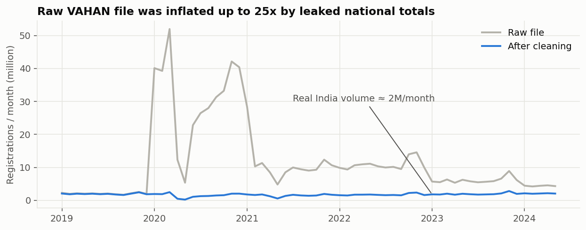
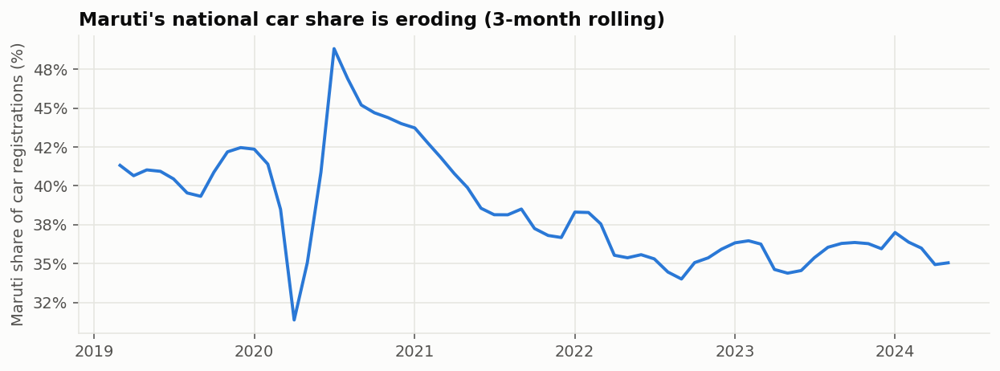
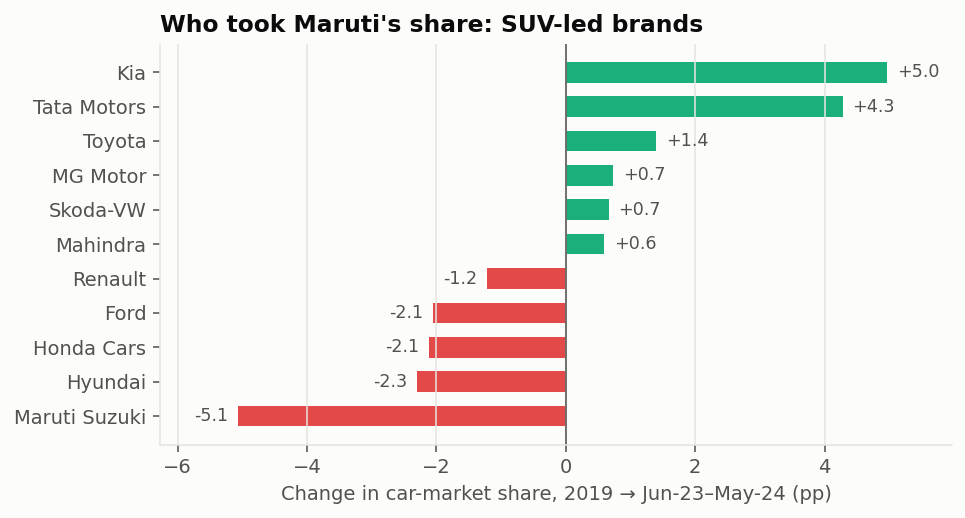
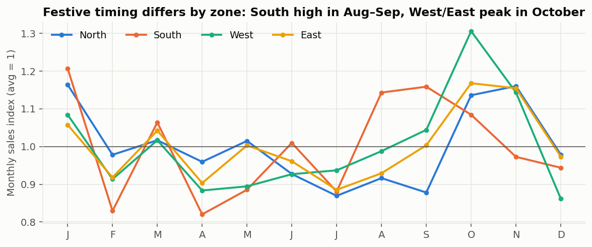
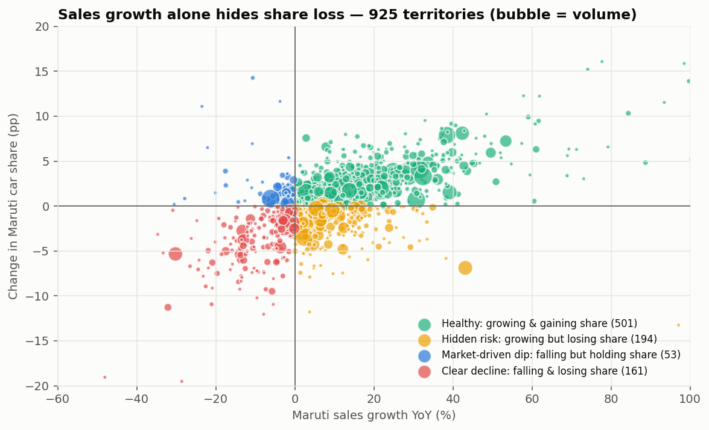
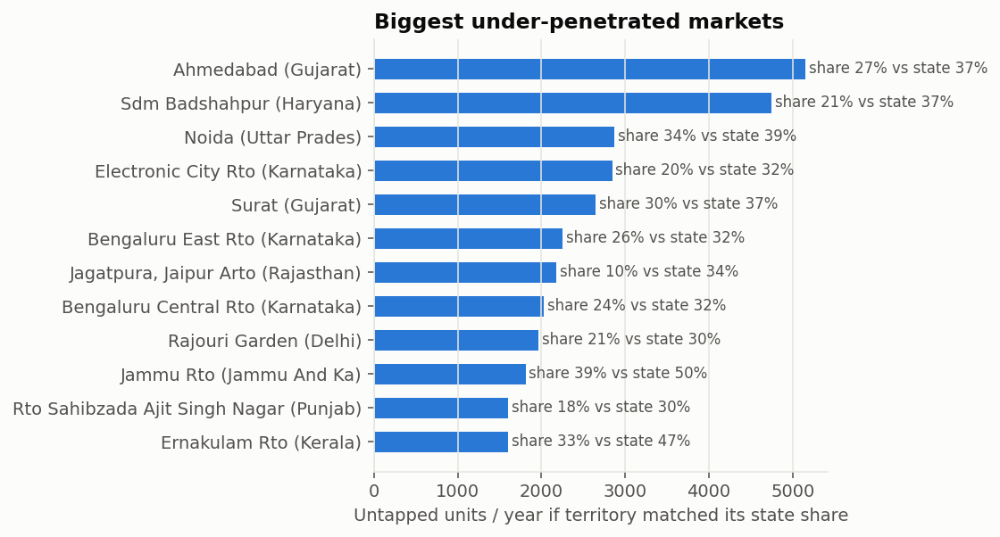
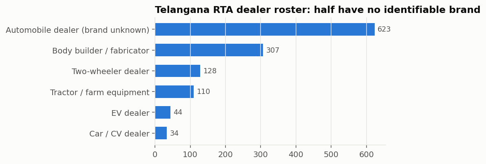

# Dealer Attention Prototype: Data Cleaning, EDA and Explanatory Analysis

**Case:** Illuminati.ai, "Which dealers need management attention?"
**Data:** VAHAN registrations by maker (MoRTH via India Data Portal) and the Telangana RTA dealer roster (Open Data Telangana)
**Reproduce:** `.venv/bin/python src/01_clean.py && .venv/bin/python src/02_build_master.py && .venv/bin/python src/03_eda.py && .venv/bin/python src/04_export_master.py`
All numbers below come from `reports/eda_stats.json`.

---

## 1. What we received

| | VAHAN by maker | Telangana dealer roster |
|---|---|---|
| Rows | 2,791,564 | 1,246 |
| Grain | RTO office × maker × month | One registered dealer (trade certificate) |
| Coverage | 34 states/UTs, 1,314 RTOs, 2,339 makers, Jan 2019 to May 2024 | 33 districts, 53 RTA offices, snapshot 06-Dec-2025 |
| Useful fields | date, state, RTO, maker, registrations | dealer name, city, district, mandal, pincode, RTA office |
| Missing for our case | dealer identity, inventory, payments, service, complaints | **brand, sales, any performance metric** |

---

## 2. Data cleaning: what was wrong and how it was fixed

The raw VAHAN file **cannot be used as-is**. Summed nationally it shows 757M registrations in 65 months. India actually registers about 2M vehicles a month, so the raw file is inflated **up to 25× in some months** (2020 shows about 40M a month).

| # | Issue found | Evidence | Fix |
|---|---|---|---|
| 1 | **National totals leaked into ordinary RTO rows** | Maruti's national Jan-2020 total (164,202) appears as the value for 19 different small RTOs. Hero's March-2020 national figure appears in 19 offices. | Office×maker baseline from verified-clean years (2019, 2023–24). Flag a row if it is more than 8× baseline. Drop a whole office-month if more than 50% of its volume is flagged. |
| 2 | **20 RTOs contaminated in most months** | e.g. Lower Siang (Arunachal) shows about 57k Maruti a month; Hindupur, Nilambur, Sdm Bhikhiwind are similar | Offices more than 50% contaminated are dropped entirely (266k rows) |
| 3 | **Non-registering offices** | "Sikar Vehicle Fitness Center", "M-S Nandan Fitness Testing Center" (fitness centres don't register new vehicles) | Dropped (45k rows) |
| 4 | **Maker mislabel** | MP 2019: "Honda Cars India" = 119k vs about 3k in every other year, which is Honda 2-wheelers mis-filed | Reclassified out of the car market |
| 5 | **Legal-entity renames/splits** | Tata Motors → Tata Motors Passenger Vehicles + Tata Passenger Electric Mobility (2022); Skoda/VW merged; "Maruti Udyog" legacy | Mapped 22 maker names to 16 brand groups |
| 6 | **Duplicate state names** | "Jammu and Kashmir" / "Jammu And Kashmir", two spellings each for Andaman and for DNH & DD | Harmonised |
| 7 | 563 duplicate keys | Same date/RTO/maker split into sub-records | Summed |
| 8 | **Administrative breaks** | Ludhiana East's *total* registrations (all brands) fall from about 2,000 to about 20 a month. Faridabad RTA halves overnight in Oct-2023. | An office's share of its zone's registrations (removes seasonality) is compared with its Jun-22..May-23 level; a sustained shift over 6 and 9 months (< 0.65× or > 1.55×) means a jurisdiction change, not dealer behaviour. 16 territories excluded (`data/processed/excluded_admin_breaks.csv`). |
| 9 | Special-purpose offices | Delhi VIU Burari (inspection unit, fleets), Haryana Head Office | Excluded from the dealer universe |
| 10 | PII in dealer roster | Personal emails and mobile numbers | Removed |

**Validation (why we trust the cleaned data).** The cleaned series reproduces known real-world events with no tuning:
- the Apr–May 2020 lockdown (0.24M in May 2020)
- the May 2021 second wave (0.58M)
- the festive peaks every Oct/Nov
- Maruti at 100–180k a month, in line with its reported retail
- Ford's collapse after its 2021 India exit

Result: **757M → 114.9M registrations**, with a full audit trail of every dropped row in `data/processed/vahan_cleaning_log.csv`.

---

## 3. Critical evaluation: how the two datasets can (and can't) be used

**VAHAN is the strong asset.** A new car is registered at the buyer's RTO, so *Maruti registrations in an RTO approximate the retail sales of the Maruti dealer(s) serving that catchment*. The same file also gives the **whole local market** (all brands), so for every territory we get real, monthly:
- sales and growth
- local market potential (car market size and growth)
- market share and share trend, including which competitor is winning there

That covers four of the seven illustrative attributes in the brief (sales vs target, sales growth, local market potential, plus competition) with **real government data**.

**The Telangana roster is weak for this use case, and we should say so openly.**
- Telangana is **absent from VAHAN** (0 rows), because it ran its own registration system in this period, so there is no geographic join.
- It has **no brand and no sales**. Brand can be inferred from names for only 133 of 1,246 dealers. 25% are body builders/fabricators and 9% tractor dealers, not OEM dealerships.
- Its legitimate value is as a **network-structure benchmark**:
  - median 17 registered dealers per RTA office
  - 33.5% of dealers in the Hyderabad metro (urban concentration)
  - 79 dealer names operate multiple outlets (174 dealers), so dealer *groups*, not single outlets, are a real management unit

**Ethics/accuracy decision:** we will **not** attach synthetic payment delays or complaints to real, named businesses. Doing so would fabricate negative records about real companies. Territories carry pseudonymous IDs (`MS-RJ-005`).

**What no public data can give us:** inventory ageing, payment delays, service performance and complaints are OEM-internal (DMS/ERP/CRM). These will be **synthetic, clearly labelled, and statistically tied to the real signals** in the next step. For example, territories with falling share and slowing sales get a higher probability of ageing stock, which mirrors how dealer stress actually propagates.

**Unit-of-analysis choice:** OEM = **Maruti Suzuki**. It has the largest network (present in about 1,250 RTOs), a stable legal name across all years, and a genuine strategic story. A "dealer territory" = Maruti × RTO. Eligibility:
- at least 240 units in the last 12 months (a realistic outlet volume)
- all 24 months reported
- no administrative break

**Result: 909 dealer territories across 6 zones.**

---

## 4. Exploratory findings

**4.1 The macro context: Maruti is losing share to SUV-led brands.**
Maruti's share of car registrations fell from **41.0% (2019) to 35.9% (Jun-23–May-24)**. Kia (+5.0 pp) and Tata (+4.3 pp) took most of it. Hyundai, Honda and Ford also lost.
 

**4.2 Volume is concentrated.** 11.9% of territories produce 50% of Maruti volume, so a handful of metro territories dominate the absolute risk.

**4.3 Seasonality differs by zone.**
- West and East peak in **October** (Navratri/Dussehra/Diwali).
- The South runs high through **Aug–Sep** (index 1.15, Onam/Ganesh Chaturthi).
- North and South both show a **January spike**, consistent with buyers deferring registration so the car carries the new model year.

---

## 5. Explanatory analysis: answering the business question

### Insight 1: Sales growth alone misleads, for about 1 in 5 dealers
Splitting 909 territories by *sales growth* and *share change* (latest 12 months vs prior 12):

| Segment | Territories | What a sales-only view says | Reality |
|---|---|---|---|
| Healthy: growing and gaining share | 501 | Fine | Fine |
| **Hidden risk: growing but losing share** | **194 (21.3%)** | "Growing, no action" | **Under-performing a growing market; competitors are taking the growth** |
| Market-driven dip: falling but holding share | 53 | "Problem dealer" | The market fell, the dealer held share. Needs support, not correction. |
| Clear decline: falling and losing share | 161 | Problem | Problem |

39.1% of territories grew slower than their local market. Examples of hidden risk:
- **Jaipur (First) RTO:** 19.5k units, +2.4% sales, but the market grew 12.7% and share fell 3.4 pp. Mahindra is the main gainer.
- **Vadodara:** sales flat, market +6.4%, share −2.2 pp.

A sales dashboard would rank both as stable.

**This is the core thesis of the prototype:** judge each dealer *relative to its own market*, not on absolute sales.

### Insight 2: The tide is turning, so laggards stand out more
Nationally, Maruti's share *recovered* about +0.8 pp in the latest 12 months, likely its own SUV push (Brezza, Grand Vitara, Fronx). A territory still losing share *now* is lagging an improving brand trend. That points to a local cause (dealer execution or a strong local competitor), not a product cause.

### Insight 3: Each problem territory has a named competitor
In territories losing share, the biggest local gainer is **Mahindra in 159, Tata in 89, Toyota in 50 and Hyundai in 48**. The corrective action is therefore specific, e.g. "Mahindra SUV conquest offers and test-drive drive in Jaipur" rather than a generic "improve sales".

### Insight 4: Untapped potential is measurable and concentrated
If every territory matched its own state's Maruti share, the network would gain about **108k units a year**. The **top 20 territories hold 39%** of that headroom: Ahmedabad, Gurugram (Badshahpur), Noida, Bengaluru (Electronic City, East, Central), Surat, Jaipur Jagatpura.

*Critical caveat:* affluent metro catchments have a structurally more premium mix (lower Maruti share is partly expected). So headroom should be read alongside market growth and the competitor gaining, not taken literally as a target.

### Insight 5: Telangana network structure (benchmark)
- 1,246 registered dealers across 53 RTA offices (median 17 per office)
- a third are in the Hyderabad metro
- 14% belong to multi-outlet groups

This argues for **group-level escalation** in the prototype: a dealer group with several weak outlets is a bigger management issue than one weak outlet.

---

## 6. What this means for the prototype

| Brief's attribute | Source in our master | Status |
|---|---|---|
| Sales vs target | Real sales; target = seasonal baseline × market growth (assumption to state) | Real + derived |
| Sales growth | `sales_growth_yoy`, `growth_last6m_yoy` | **Real** |
| Local market potential | `car_market_l12m`, `market_growth_yoy`, `headroom_units` | **Real** |
| Competition / share | `share_change_pp`, `top_competitor_gainer` | **Real (bonus)** |
| Inventory ageing | to be generated | Synthetic, correlated |
| Payment delays | to be generated | Synthetic, correlated |
| Service performance & complaints | to be generated | Synthetic, correlated |

**Proposed next step:** add the synthetic operational layer, then build a transparent **Dealer Health Score**:
- weighted pillars for Market performance, Momentum, Financial health and Customer health
- a priority rank (risk × volume at stake)
- a rule-based "why" plus a recommended action per dealer (support vs corrective)

The prototype then becomes a regional-manager screen: *pick a zone/state → see the ranked attention list → open a dealer → see why and what to do.*

## 7. Limitations of the data (for the "one key limitation" slide)
- RTO registration is a **proxy** for dealer sales. One RTO may be served by several dealers, and buyers can register outside their dealer's town.
- The car market includes some Tata/Mahindra light commercial vehicles, so share levels run a few pp below published PV share. Trends are unaffected.
- Data ends May 2024; Telangana isn't covered by VAHAN in this file.
- Operational metrics (inventory, payments, service, complaints) are synthetic because OEMs don't publish them.

---

## 8. Modelling decisions made while building the prototype (with evidence)

These come from `src/06_validate.py` and are reproduced in the app's *Method & Data* view.

| Question | Test | Result | Decision |
|---|---|---|---|
| Are 12-month share changes real or noise? | Quasi-binomial z-test. Dispersion φ = 2, from the median Pearson dispersion of monthly share (2.3). | Only about a third of share changes are significant. Of the 194 "growing but losing share" territories, about 36 are statistically real. | Alerts need significance, which removes most false alarms. |
| Does a significant loss predict more loss? | Backtest: 12 monthly origins (Jun-22 to May-23), 12-month outcome | Significant losers lose a further −0.88 pp vs −0.37 pp for others. 96% of territories more than 5 pp below their state are still below 12 months later. | Use as a current-state alert, and treat persistent under-penetration as structural. |
| Can ML predict next-year share loss? | Logistic / gradient boosting, out-of-time (train origins in 2021-22, test origins in 2023) | AUC 0.62 / 0.61, vs 0.65 for a one-line rule. The base rate shifted from 64% to 34%. | **Not deployed**: no gain, and its probabilities would be mis-calibrated. |
| Is the state average a fair benchmark? | Out-of-fold gradient boosting of share on market structure | R² 0.42, error 6.0 pp vs 6.7 pp for the state average. An earlier R² of 0.51 came from leave-one-out target-encoding leakage and was fixed. | Use as an "expected share for this market type" benchmark. |
| Are small dealers flagged on noise? | Empirical-Bayes reliability n/(n+K) | Growth-rate noise for a 300-unit dealer is about ±8 pp | Noisy rates are shrunk towards neutral (K = 140 for growth, 70 for target achievement). |
| Does the engine catch emerging problems? | Synthetic ground truth: 102 injected events in Feb–May 2024 | Recall: service disruption 97%, credit squeeze 97%, stock push 82% | Kept a "change in 3 months" signal for each operating metric. |
| Is stock stress the root cause or a symptom? | Co-occurrence: 132 of the attention dealers had both a sales alert and a stock/credit alert | Stock builds when dispatches follow the target but retail falls short | New diagnosis, **"Sales slump → stock stress"**: fix sales first, relieve stock in parallel. |
